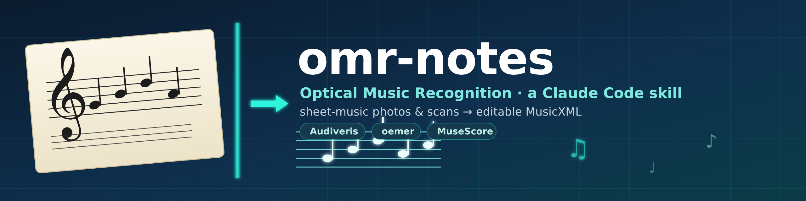

<p align="center">
  
</p>

# omr-notes

**Sheet-music toolkit for [Claude Code](https://claude.com/claude-code) — two chained skills:**

| Skill | Does |
|---|---|
| **[omr-notes](skills/omr-notes)** | photo/scan of printed sheet music → editable **MusicXML** |
| **[notes-to-piano](skills/notes-to-piano)** | that MusicXML/MIDI → realistic **piano audio** (WAV/MP3), fully offline |

Together: **a photo of a score becomes something you can both edit and hear.**

> OMR, not OCR: it recognises staves, clefs, notes and rhythm, not text.

## Why this skill

Both OMR engines (Audiveris, oemer) **merge several pieces printed on one page**
into a single score. This skill **splits the page first** — cutting at the large
whitespace above each title — so every piece is recognised on its own. That alone
is the difference between usable output and a garbled mess on real songbook pages.

## Install

### As a Claude Code plugin (recommended)

```text
/plugin marketplace add Neanderthal/omr-notes
/plugin install omr-notes@omr-notes
/plugin install notes-to-piano@omr-notes
```

### Manual (clone into your skills folder)

```bash
git clone https://github.com/Neanderthal/omr-notes.git
cp -r omr-notes/skills/omr-notes ~/.claude/skills/omr-notes
```

## One-time setup

The engines need a Python venv and Audiveris. Run once:

```bash
~/.claude/skills/omr-notes/scripts/setup.sh
```

It creates a venv at `~/.local/share/omr-notes/venv` (numpy<2, onnxruntime 1.17,
oemer, verovio, cairosvg, opencv) and installs Audiveris (bundled JRE) to
`~/.local/share/omr-notes/audiveris`. See
[`skills/omr-notes/references/setup.md`](skills/omr-notes/references/setup.md) for
version pitfalls.

## Quick start

```bash
# full pipeline: split -> recognise -> render check
python3 scripts/omr.py IMAGE.jpg -o OUTDIR --engine audiveris --render --debug
```

Outputs under `OUTDIR/<image>/`:

- `pieces/…_pieceNN.png` — one image per detected piece (+ `_overlay.png` cut map with `--debug`)
- `audiveris/…_pieceNN.mxl` (or `oemer/…_pieceNN.musicxml`) — MusicXML per piece
- `…_render.png` — a verovio render of the result, for eyeballing accuracy

### Engines

| Engine | Best for | Notes |
|---|---|---|
| **audiveris** (default) | printed multi-staff scores | best structural fidelity; GUI editor for fixes; needs resolution (crops upscaled 3×) |
| **oemer** | raw phone photos, single-line melodies | one `pip`; garbles clefs/staves on complex layouts |
| **both** | — | run each and compare renders |

### Splitting controls

- `--pieces N` — force exactly N pieces
- `--min-gap PX` — a whitespace gap ≥ PX is a boundary
- `--no-split` — treat the whole image as one piece
- `--scale F` — upscale factor for crops (default 3.0)

Always check `_overlay.png` (`--debug`) and re-run with an override if a cut is wrong.

After OMR, fix residual errors in **MuseScore 4** — see
[`skills/omr-notes/references/workflow.md`](skills/omr-notes/references/workflow.md).

## Hear it: `notes-to-piano`

The companion skill renders a score into **piano audio** — deterministic
synthesis of the written notes (not AI-composed), **fully offline**.

```bash
# one-time: venv + music21 + a CC-BY piano soundfont (~37 MB)
skills/notes-to-piano/scripts/setup.sh          # --salamander for the 310 MB grand

# MusicXML/.mxl/.mid -> MIDI + WAV + MP3
python3 skills/notes-to-piano/scripts/to_piano.py SCORE.mxl -o OUT --mp3 --humanize
```

Pipeline: **MusicXML → MIDI** (music21) **→ WAV** (FluidSynth + soundfont)
**→ MP3** (ffmpeg). Options: `--humanize` (velocity + micro-timing),
`--tempo`, `--normalize`, `--soundfont`, `--pdf`. Soundfonts and licensing:
[`skills/notes-to-piano/references/soundfonts.md`](skills/notes-to-piano/references/soundfonts.md).

Chained end to end: **photo → `omr-notes` → MusicXML → `notes-to-piano` → piano MP3.**

## Repository layout

```
.claude-plugin/marketplace.json     # marketplace manifest (lists both plugins)
skills/
├── omr-notes/                      # photo/scan -> MusicXML
│   ├── .claude-plugin/plugin.json
│   ├── SKILL.md
│   ├── scripts/                    # omr.py, split_pieces.py, render_musicxml.py, setup.sh
│   └── references/                 # setup.md, workflow.md
└── notes-to-piano/                 # MusicXML/MIDI -> piano audio
    ├── .claude-plugin/plugin.json
    ├── SKILL.md
    ├── scripts/                    # to_piano.py, setup.sh
    └── references/                 # soundfonts.md
```

## License

MIT © Sergey Istomin. See [LICENSE](LICENSE).
